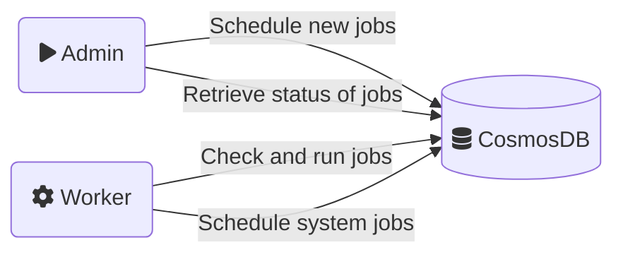
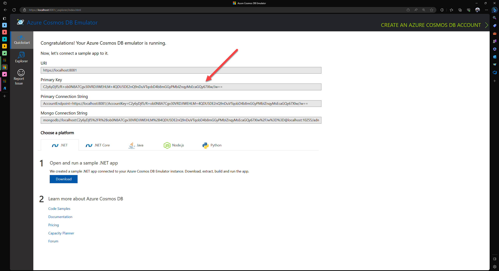
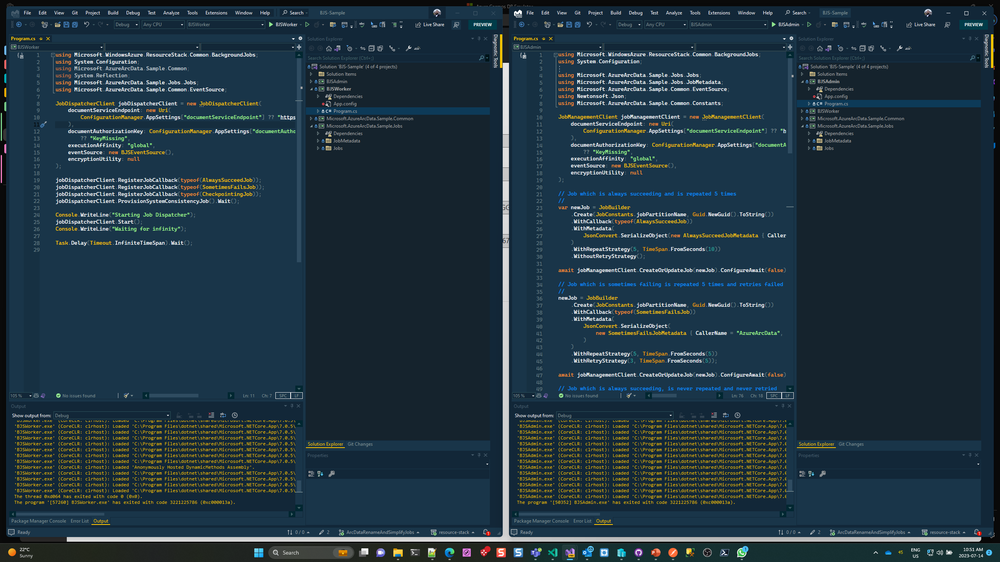
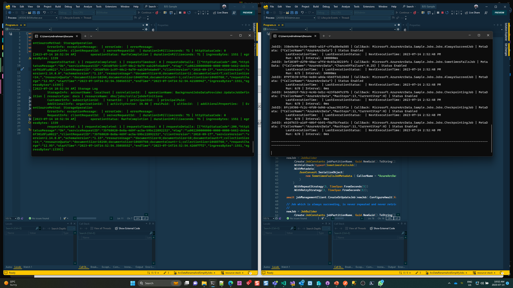
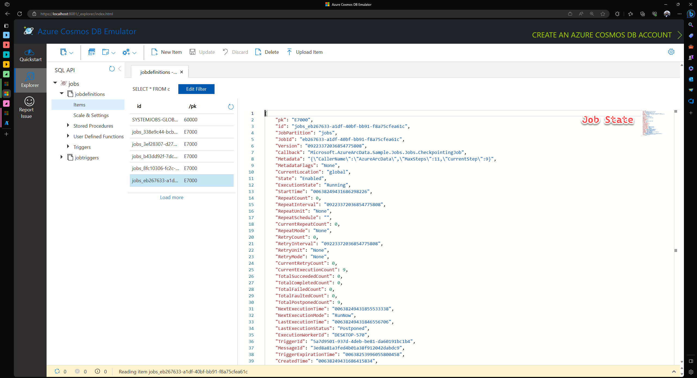
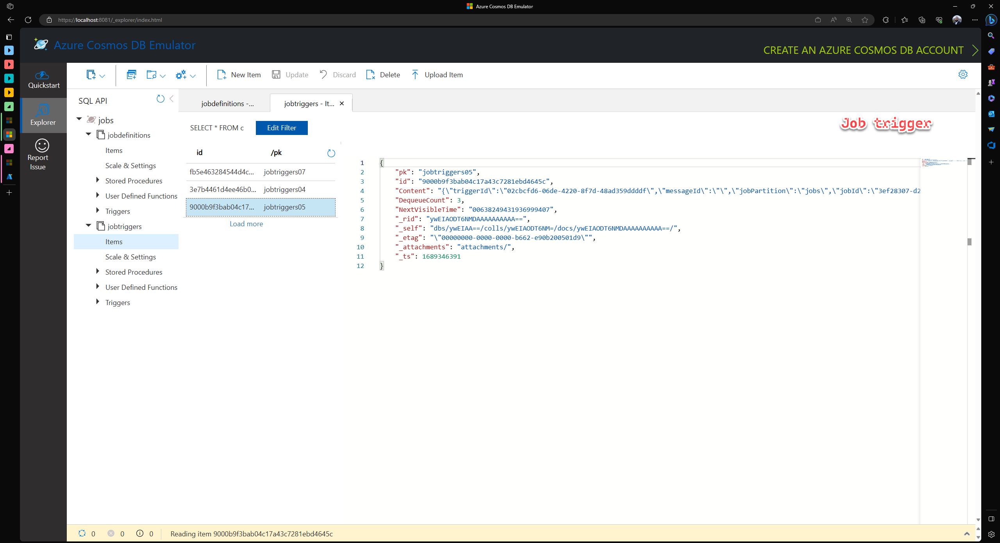
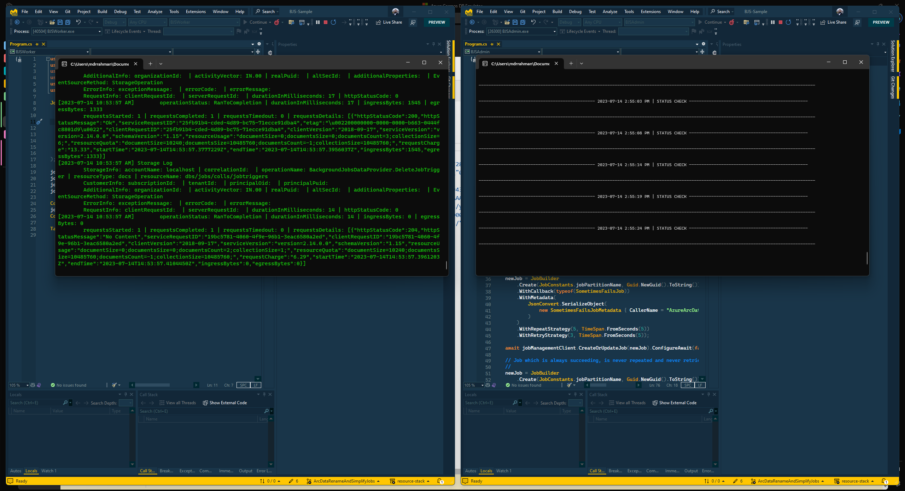

# Resource Stack - [Background Job Service](https://msazure.visualstudio.com/One/_wiki/wikis/One.wiki/20671/Resource-Stack-(BJS))

<!-- TOC depthfrom:2 -->

- [Resource Stack - Background Job Service](#resource-stack---background-job-service)
  - [What is BJS?](#what-is-bjs)
    - [Features](#features)
  - [Contents of this example](#contents-of-this-example)
  - [Caveats](#caveats)
  - [Links](#links)
  - [Pre-reqs](#pre-reqs)
  - [How to run this tutorial](#how-to-run-this-tutorial)
  - [Exploring different state-stores](#exploring-different-state-stores)
    - [1. Azure Storage](#1-azure-storage)
    - [2. Cosmos DB](#2-cosmos-db)
    - [3. SQL](#3-sql)
    - [4. In-Memory](#4-in-memory)
  - [Exploring Job Scheduling](#exploring-job-scheduling)

<!-- /TOC -->
## What is BJS?
BJS is an internal battle tested framework to schedule and run jobs. Originating from AzureUX-ResourceStack It's used by the PowerApps to run their large amount of background jobs.

### Features

- Job scheduling
- Job sequencing using DAGs
- Repeat logic for high flexibility on scheduling
- Multiple options for retry strategies (different back-off strategies, max retries, etc.)
- Support for checkpoint and continuation
- High scalability
- Simple interface
- Does not require any additional processes for queue grooming or consistency checks

## Contents of this example

This example builds two executables.

| Name       | Description                                                                        |
| ---------- | ---------------------------------------------------------------------------------- |
| BJS-Admin  | Schedule and query various types of jobs.                                          |
| BJS-Worker | Runtime environment for jobs, also contains system job to ensure data consistency. |

Another component needed is CosmosDB, for testing the local emulator is sufficient.



## Caveats

1. BJS requires a specific consistency configuration in CosmosDB.
    > ### Cosmos DB consistency model
    > BJS depends on Read-Your-Writes consistency model to function properly. By default, Cosmos DB account is configured with weaker Session consistency. Please reconfigure this to at least Bounded-Staleness. Failure to update Cosmos DB consistency setting will result in failures and intermittent job execution delays.
2. BJS is a DotNet library, no other languages are supported.

## Links
- [BJS One.wiki](https://msazure.visualstudio.com/One/_wiki/wikis/One.wiki/20671/Resource-Stack-(BJS))
- [BJS OneBranch](https://msazure.visualstudio.com/DefaultCollection/One/_git/AzureUX-ResourceStack?path=/src/common/jobs&version=GBmaster)
- [BJS in PowerApps](https://eng.ms/docs/cloud-ai-platform/business-applications-and-platform/bap-dataverse/dv-infrastructure/coreservices-microservices-infrastructure/powerapps-coreservices-wiki/librariesandsdks/backgroundjobservicebjs/bjsincoreframework)

## Pre-reqs

- Visual Studio Community
- Intall Cosmos DB Emulator on a Windows machine [from here](https://learn.microsoft.com/en-us/azure/cosmos-db/local-emulator?tabs=ssl-netstd21#download-the-emulator)

## How to run this tutorial

1. Run the Cosmos DB Emulator - browsable at `https://localhost:8081/_explorer/index.html`
   
   

2. Put the Primary Key into `App.config` of both `BJS-Admin` and `BJS-Job` - so both can connect:

```xml
<?xml version="1.0" encoding="utf-8" ?>
<configuration>
  <appSettings>
    <add key="documentServiceEndpoint" value="https://localhost:8081"/>
    <add key="documentAuthorizationKey" value="C2y6yDj...=="/>
  </appSettings>
</configuration>
```

3. Run both apps in seperate windows:

    

4. `BJS-Admin` spins up `Jobs`, `BJS-Job` executes them:

    

5. Cosmos DB will store execution state:

    

    

6. All Jobs are done:

    
   

## Exploring different state-stores
### 1. Azure Storage

`TODO`

---

### 2. Cosmos DB

See above.

---

### 3. SQL

Set this in the `App.config`
```xml
<?xml version="1.0" encoding="utf-8" ?>
<configuration>
  <appSettings>
    <add key="sqlServerConnectionString" value="Server=localhost;Database=master;Trusted_Connection=True;" />
  </appSettings>
</configuration>
```

And, cleanup logic for tables generated:

```sql
USE master;

-----------------------
-- VIEW
-----------------------

SELECT * FROM dt.arcJobDefinitions;
SELECT * FROM dq.jobtriggers04;

-----------------------
-- CLEANUP
-----------------------

-- Tables -------------

DECLARE @TableName NVARCHAR(255);
DECLARE @SchemaName NVARCHAR(255);
DECLARE @DropSQL NVARCHAR(MAX);

DECLARE TableCursor CURSOR FOR
SELECT TABLE_NAME, TABLE_SCHEMA
FROM INFORMATION_SCHEMA.TABLES
WHERE TABLE_TYPE = 'BASE TABLE'
  AND (TABLE_SCHEMA LIKE 'dq%' OR TABLE_SCHEMA LIKE 'dt%');

OPEN TableCursor;

FETCH NEXT FROM TableCursor INTO @TableName, @SchemaName;

WHILE @@FETCH_STATUS = 0
BEGIN
    SET @DropSQL = 'DROP TABLE [' + @SchemaName + '].[' + @TableName + '];';
    EXEC sp_executesql @DropSQL;
	PRINT 'Table [' + @SchemaName + '].[' + @TableName + '];' + 'dropped successfully.';

    FETCH NEXT FROM TableCursor INTO @TableName, @SchemaName;
END;

CLOSE TableCursor;
DEALLOCATE TableCursor;

-- Types -------------

IF EXISTS (
    SELECT 1
    FROM sys.types
    WHERE name = 'arcJobDefinitionsOperationType'
)
BEGIN
    -- Drop the type if it exists
    DROP TYPE [dt].[arcJobDefinitionsOperationType];
    PRINT 'Type "arcJobDefinitionsOperationType" dropped successfully.';
END
```


---

### 4. In-Memory

`TODO`

## Exploring Job Scheduling

`TODO`