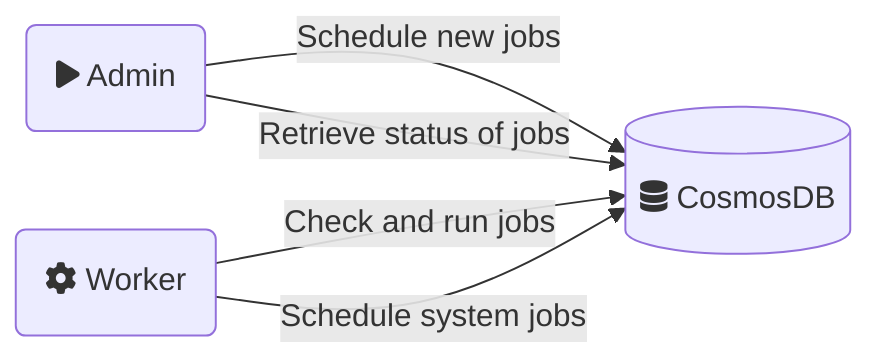

# Resource Stack - [Background Job Service](https://msazure.visualstudio.com/One/_wiki/wikis/One.wiki/20671/Resource-Stack-(BJS))

## What is BJS?
BJS is an internal battle tested framework to schedule and run jobs. Originating from AzureUX-ResourceStack It's used by the PowerApps to run their large amount of background jobs.

### Features

- Job scheduling
- Job sequencing using DAGs
- Repeat logic for high flexibility on scheduling
- Multiple options for retry strategies (different back-off strategies, max retries, etc.)
- Support for checkpoint and continuation
- High scalability
- Simple interface
- Does not require any additional processes for queue grooming or consistency checks

## Contents of this example

This example builds two executables.

| Name       | Description                                                                        |
| ---------- | ---------------------------------------------------------------------------------- |
| BJS-Admin  | Schedule and query jobs.                                                           |
| BJS-Worker | Runtime environment for jobs, also contains system job to ensure data consistency. |

Another component needed is CosmosDB, for testing the local emulator is sufficient.

## Caveats

1. BJS requires a specific consistency configuration in CosmosDB.
    > ### Cosmos DB consistency model
    > BJS depends on Read-Your-Writes consistency model to function properly. By default, Cosmos DB account is configured with weaker Session consistency. Please reconfigure this to at least Bounded-Staleness. Failure to update Cosmos DB consistency setting will result in failures and intermittent job execution delays.
2. BJS is a DotNet library, no other languages are supported.

## Links
- [BJS One.wiki](https://msazure.visualstudio.com/One/_wiki/wikis/One.wiki/20671/Resource-Stack-(BJS))
- [BJS OneBranch](https://msazure.visualstudio.com/DefaultCollection/One/_git/AzureUX-ResourceStack?path=/src/common/jobs&version=GBmaster)
- [BJS in PowerApps](https://eng.ms/docs/cloud-ai-platform/business-applications-and-platform/bap-dataverse/dv-infrastructure/coreservices-microservices-infrastructure/powerapps-coreservices-wiki/librariesandsdks/backgroundjobservicebjs/bjsincoreframework)